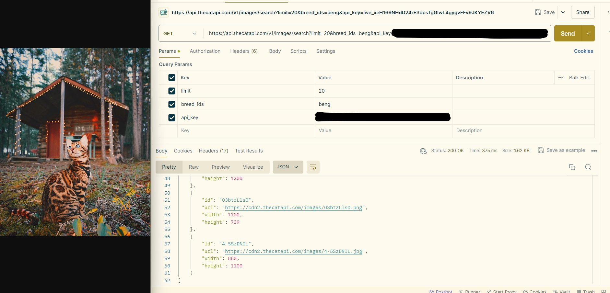
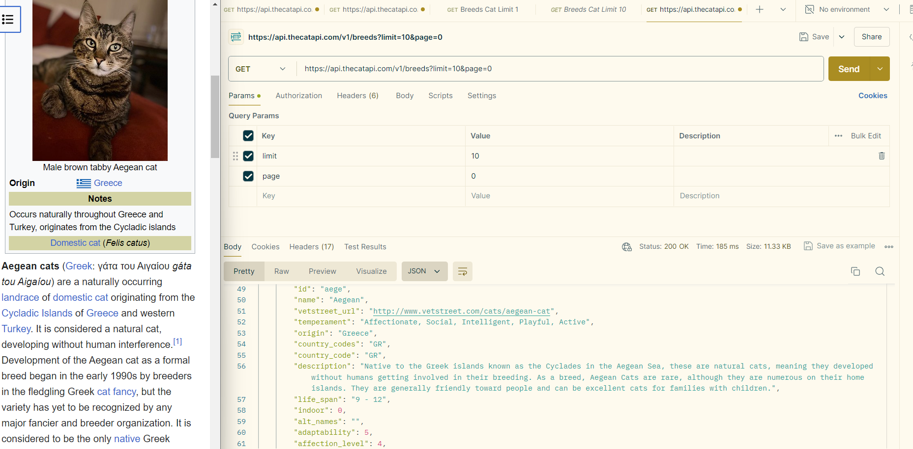

# API Testing Project

This project illustrates the knowledge I gained after completing both Manual and Automation testing courses.

- Start time: June 2024

- End time: July 2024

**Structure of the Project:**

###### What is an API?
###### What is REST?
###### How Rest Api Works
###### What is Postman?
######  What is Newman?

**What is an API?** 

#### API (Application Programming Interface):
- An API is a set of rules and definitions that allows two or more computer programs or components to communicate with each other. 
- In essence, an API serves as a contract between different software components, ensuring they can work together in a predictable and efficient manner.

**What is REST?**

#### REST (Representational State Transfer):
- REST is a way to design web services so that different software systems can communicate over the internet in a simple and consistent way.

**How REST API Works**

###### Client: The client sends an HTTP request to the server.
###### HTTP Request: The request is received and processed by the server.
###### Server: The server retrieves or modifies the resource as needed.
###### Resource Representation: The server creates a representation of the resource (often in JSON or XML format).
###### Server: The server sends an HTTP response back to the client, including the resource representation.

**RESTful APIs commonly use standard HTTP methods to perform operations:**
- GET: Retrieve a resource.
- POST: Create a new resource.
- PUT: Update an existing resource.
- DELETE: Remove a resource.
- PATCH: Partially update a resource.

**What is Postman?**
#### Postman is an API platform for building and using APIs. 
- You can send requests in Postman to connect to APIs you are working with. A Postman Collection is a set of API endpoints or requests, along with each endpoint's authorization type, parameters, headers, request bodies, tests, and settings grouped under the same collection ID.
- A collection enables you to group requests with different method types (e.g., GET, POST, DELETE, and PUT) and organize them into folders  or subfolders.
- Postman Monitors give you continuous visibility into the health and performance of your APIs.

**What is Newman?**
#### Newman is a command-line Collection Runner for Postman. 
- It enables you to run and test a Postman Collection directly from the command line. 
- It's built with extensibility in mind so that you can integrate it with your continuous integration (CI) servers and build systems.

## Let's get started 

**Web APIs Under Test**
- Chuck Norris
- Open Weather
- Cats and Dogs
- JSON Placeholder

**Key Notes:**
- One key objective in API testing is to validate that the service or application can effectively handle expected data volumes within required time frames, both for receiving and sending data.

#### Verification Process:
- Installing the necessary tools: Postman, GitHub Desktop, Visual Studio Code, Newman
- Creating accounts and logging into the apps
- API Authorization where needed with Access Token
- Reading the necessary documentation for the endpoints of the APIs under test

#### Validation Process:
- Starting with the **GET** method:
- Website:[**Chuck Norris**](https://https://api.chucknorris.io/)
- The endpoints for Chuck Norris website that I am using are: Music, Food, and Jokes with different response formats

**The Endpoint Path:**
- Append the category endpoint to the base URL.
 For example:
- For jokes: https://api.chucknorris.io/jokes/random
- For food: https://api.chucknorris.io/jokes/random?category=food
- For music: https://api.chucknorris.io/jokes/random?category=music
- Send Request:Postman will fetch a Chuck Norris joke based on the category I specified
- View Response: 200 OK  

- This way, I enjoyed Chuck Norris jokes tailored to different themes directly through Postman using the Chuck Norris API.
- It’s a great way to have some fun and explore the humorous side of Chuck Norris!

## Next Up: Weather API 

#### Validation Process:
- Using the **GET** method:
- Website: [**OpenWeatherMap**](https://openweathermap.org/)
- The endpoints for OpenWeatherMap that I am using are: 
- Current weather data by geographic coordinates, city name, and with different response formats

**The Endpoint Path:**
-  Append the category endpoint to the base URL.
- Base URL: https://api.openweathermap.org/data/2.5/weather
- API Key: <Your_API_Key>

**Category Endpoints:**

#### Verification Process:

######  lat: Latitude. Required for geolocation requests.
######  lon: Longitude. Required for geolocation requests.
######  appid: Your unique API key.
######  mode: Optional response format (xml, html, or JSON).
######  units: Optional units of measurement (standard, metric, or imperial).
######  lang: Optional language for the response.

**Starting with**
- URL: https://api.openweathermap.org/data/2.5/weather?q=Bucharest,RO&appid=<Your_API_Key>
- Send Request and View Response: 
- Click the Send button and ensure the response status is 200 OK.
- Response Examples:
- Get Weather by City Name (Bucharest):
- JSON Response:

- URL: https://api.openweathermap.org/data/2.5/weather?lat=57&lon=-2.15&appid={Your_API_Key>}&units=metric
- Send Request and View Response: 
- Click the Send button and ensure the response status is 200 OK.
- Response Examples:
- Get Weather by City Name (Bucharest) with temperature in Celsius
- JSON Response:

- URL: https://api.openweathermap.org/data/2.5/weather?lat=57&lon=-2.15&appid={Your_API_Key>}&units=imperial
- Send Request and View Response: 
- Click the Send button and ensure the response status is 200 OK.
- Response Examples:
- Get Weather by City Name (Bucharest) with temperature in Fahrenheit
- XML Response:

- URL: https://api.openweathermap.org/data/2.5/weather?q=Bucharest,RO&appid=<Your_API_Key>
- Send Request and View Response: 
- Click the Send button and ensure the response status is 200 OK.
- Get Weather by City Name (Gent) 
- XML Response:

🌍 Access Current Weather Data Everywhere! 🌤️
- After successfully completing my weather API call, I'm excited to share the power of accessing current weather data from any location on Earth! 

 ## Next one 
 
 

 #### Start exploring the world of cats!
- [The Cat API](https://thecatapi.com/)
- The endpoints for The Cat API website that I am using are: Images, Breeds, and Facts with different response formats.
#### Verification process:
- Get started with your cat-tastic adventure with entering the email and receiving the unique APi key in the email.

The Endpoint Path:
###### Images: Retrieve images of cats.
###### Breeds: Get information about different cat breeds.
###### Facts: Discover interesting facts about cats.
- Send Request:Use Postman to fetch data from The Cat API based on the category you specify.
- View Response: 200 OK

#### Validation Process:
###### Images: Retrieve images of cats.
- Starting with the **GET** method:
- Click on this to get a random **Image** [Random Images Cats](https://api.thecatapi.com/v1/images/search)
- Send Request and View Response: 
- Click the Send button and ensure the response status is 200 OK.
- Response Examples: Get random images with cats
- JSON Response:

- View Response: 200 OK

##### Please note:
- To get more than 10 images, and additional fields then be sure to use your API Key received on the email.
- Starting with the **GET** method:
- [**20** random images](https://api.thecatapi.com/v1/images/search?limit=10)
- JSON Response:

- View Response: 200 OK

###### Breeds: Get information about different cat breeds.
- Starting with the **GET** method:
- [Breeds with Wikipediainfo](https://api.thecatapi.com/v1/breeds?limit=10&page=0)
- JSON Response:

- View Response: 200 OK 

### Summary of Testing Results
- Testing of The Cat API revealed that the Images, Breeds, endpoints are generally reliable and functional. 
- All endpoints responded as documented, with average response times within acceptable limits.
- Overall, The Cat API is a robust and reliable API that meets its intended purposes effectively. 
